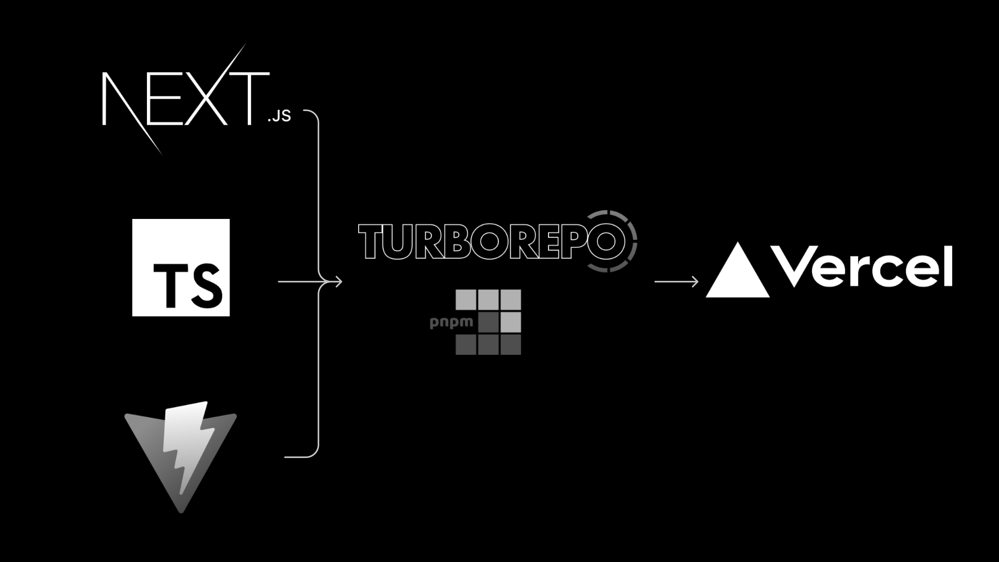
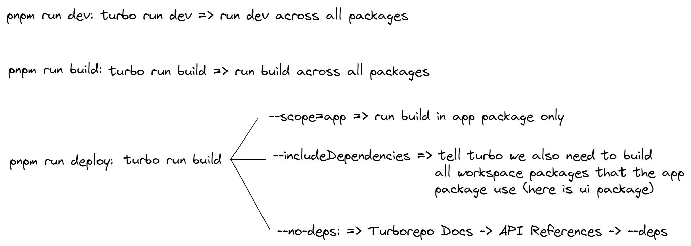
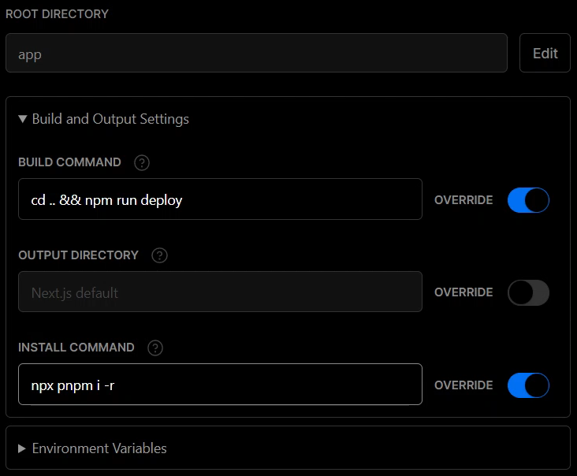

## Turborepo + PNPM Workspace with Next.js, Vite and Typescript

A simple example using Turborepo + PNPM Workspace with Next.js (for main website), Vite.js (for developing components) and Typescript.

Commands:

Vercel Config:

